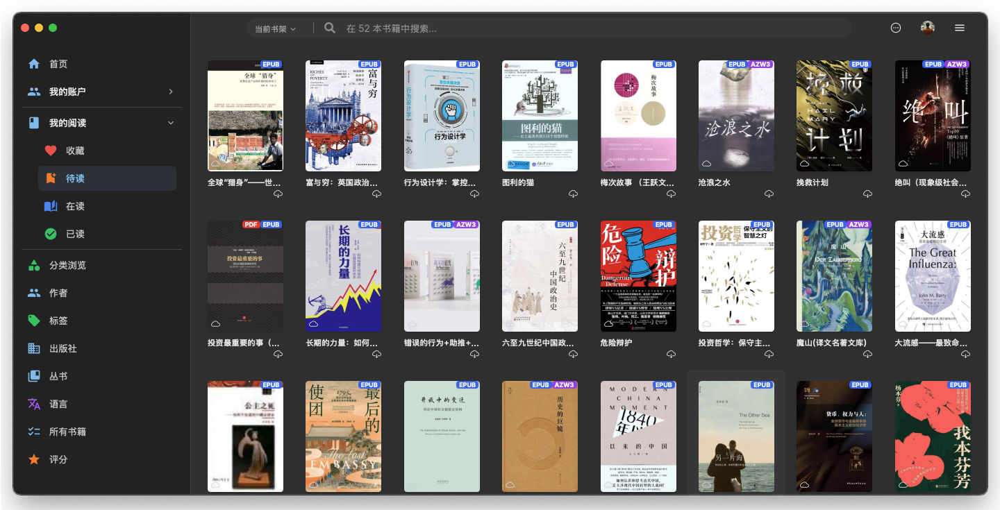

# MyReader: My Reader for MyBooks
[](https://github.com/poxenstudio/myreader/blob/main/LICENSE)


<p align="center">
  
</p>

## Introduction
当前项目是基于[Readest](https://github.com/readest/readest)实现的个人书库[MyBooks](https://github.com/PoxenStudio/mybooks)阅读客户端，不是MyBooks的管理工具，只提供用户登录、个人账号管理及多种形式的搜索及查询功能、从MyBooks中下载并阅读的功能、将阅读数据同步到MyBooks等功能。



文档[MyReader API](document/MyBooks_WebAPI.md)中为MyBooks的API定义。

主要变更包括：
1. 实现MyBooks账户的登录与注销功能。
2. 在UI首页增加MyBooks提供的不同方式的书籍分类，包括分类、标签、作者、出版社、语言、系列和评分等。
  通过UI左侧增加导航菜单实现分类导航，然后调用MyBooks的接口展示所使用的分类列表和书籍列表。
3. 增加对MyBooks书籍的下载及阅读支持。 书籍信息分为本地和云端两类, 但不需要做自动同步的操作。之前的多云端同步的功能需要禁用，只做为MyBooks中书籍下载和本地阅读的功能。
4. Library中的搜索区分当前书架为本地图书时即搜索本地图书，其它情况则为使用MyBooks的搜索接口进行搜索，并使用书架展示。
5. 支持将阅读数据同步到MyBooks。

## 安装运行
在Release中下载对应平台的安装包进行安装。所有安装包都没有进行签名，macOS下需要下载后对下载的dmg执行如下命令:
```
sudo xattr -rd com.apple.quarantine MyReader-<xxxxxxxxxxx>.dmg
```

## 书库目录及日志目录

MyReader 会在应用私有数据目录下维护本地书库文件（`MyReader/Books`）和运行日志，不同系统下的具体路径如下（`<AppId>` 固定为 `com.poxenstudio.myreader`）：

| 系统 | 书库目录 | 日志目录 |
| --- | --- | --- |
| Windows | `%APPDATA%\<AppId>\MyReader\Books` | `%LOCALAPPDATA%\<AppId>\logs` |
| macOS | `~/Library/Application Support/<AppId>/MyReader/Books` | `~/Library/Logs/<AppId>` |
| Linux | `~/.local/share/<AppId>/MyReader/Books`（或 `$XDG_DATA_HOME/<AppId>/MyReader/Books`） | `~/.local/share/<AppId>/logs`（或 `$XDG_DATA_HOME/<AppId>/logs`） |
| Android | `/data/user/0/<AppId>/MyReader/Books` | `/data/user/0/<AppId>/logs` |
| iOS | `<App 沙盒目录>/Library/Application Support/<AppId>/MyReader/Books` | `<App 沙盒目录>/Library/Application Support/<AppId>/logs` |

说明：
- Windows/macOS/Linux 桌面端可在设置中配置"自定义根目录"，配置后书库与日志目录会分别改为 `<自定义目录>/MyReader/Books` 与 `<自定义目录>/Log`。
- Android、iOS 下书库和日志都位于应用沙盒内的私有存储，属于应用私有数据，普通文件管理器 / Files App 无法直接访问；iOS 的沙盒目录路径会随应用重新安装变化，不是固定路径。

## Development

请按照以下步骤克隆并构建项目。

### 1. 克隆仓库

```bash
git clone https://github.com/poxenstudio/myreader.git
cd myreader
```

### 2. 安装依赖

```bash
# 代码更新后可能需要重新运行此命令
git submodule update --init --recursive
# 如果submodule目录为空，可以增加参数重试: --force --checkout
pnpm install
# 将 vendor 库复制到 public 目录
pnpm --filter @poxenstudio/myreader setup-vendors
```

### 3. 验证依赖安装

运行以下命令确认所有依赖已正确安装：

```bash
pnpm tauri info
```

此命令将显示已安装的 Tauri 依赖和平台配置信息。输出可能因操作系统和环境配置不同而有所差异，请查看针对您平台的输出以发现潜在问题。

对于 Windows 目标平台，必须安装 "Visual Studio 2022 生成工具"（或更高版本）及 "使用 C++ 的桌面开发" 工作负载。对于 Windows ARM64 目标平台，必须安装 "VS 2022 C++ ARM64 生成工具" 和 "C++ Clang Compiler for Windows" 组件。同时确保 `clang` 可在 PATH 中找到，例如通过将 `C:\Program Files (x86)\Microsoft Visual Studio\2022\BuildTools\VC\Tools\Llvm\x64\bin` 添加到环境变量 `Path` 中。

### 4. 开发模式构建

```bash
# 启动 Tauri 应用开发
pnpm tauri dev
# 或启动 Web 应用开发
pnpm dev-web
# 使用 OpenNext 构建预览 Web 应用
pnpm preview
```

Android:

```bash
# 初始化 Android 环境（运行一次），需要提前安装Android开发环境，Windows上需要打开发者模式
rm app/src-tauri/gen/android
pnpm tauri android init
# app/src-tauri/gen/android 整个目录被 .gitignore 排除，不会被 git 追踪，
# 所以每次 init 都会重新生成一份不带下面这行补丁的 build.gradle.kts。
# tauri-plugin-native-bridge 声明了 foss/googleplay 两个 store 维度的 flavor，
# 缺这一行 Gradle 会因为无法在两者间选择而构建失败，每次 init 后都要重新执行：
sed -i '/defaultConfig {/a\        missingDimensionStrategy("store", "foss", "googleplay")' app/src-tauri/gen/android/app/build.gradle.kts
pnpm tauri icon ../data/icons/myreader-book.png

pnpm tauri android dev
# 或在真机上开发
pnpm tauri android dev --host <development pc ip>
```

```bash
# 构建APK
cd app
# 打包全架构包(universal)
pnpm tauri android build
# 只打包aarch64的包
pnpm tauri android build -t aarch64
```

iOS:

```bash
# 设置 iOS 环境（运行一次）
pnpm tauri ios init
pnpm tauri icon ../../data/icons/myreader-book.png

pnpm tauri ios dev
# 或在真机上开发
pnpm tauri ios dev --host
```

### 5. 生产环境构建

```bash
pnpm tauri build
pnpm tauri android build
pnpm tauri ios build
```

### 6. 使用 Nix 设置开发环境

如果已安装 Nix，可以利用 flake 进入包含所有必要依赖的开发 shell：

```bash
nix develop ./ops  # 进入 Web 应用开发 shell
nix develop ./ops#ios # 进入 iOS 应用开发 shell
nix develop ./ops#android # 进入 Android 应用开发 shell
```
