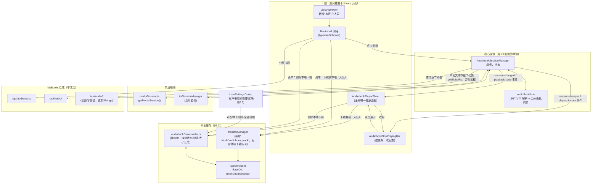

# MyReader 有声书（Audiobook）功能设计方案

状态：**待评审**（草案 v1）
关联参考实现：`/Volumes/data/projects/reader/mybooks/app/src/pages/audio/_id.vue`（MyBooks 前端自带播放器）
关联后端：`/Volumes/data/projects/reader/mybooks/webserver/handlers/audio.py`（本次不改动，仅消费其现有接口）

## 0. 已与用户确认的范围决策

在写方案前已就以下 4 个关键点向用户确认，结论直接作为本方案的约束条件：

| 决策点 | 结论 |
| --- | --- |
| 侧边栏“有声书书架”交互形态 | **复用现有书库网格视图**：新增 `source=cloud&type=audiobooks` 入口，沿用 `Bookshelf` 网格浏览；点击网格项对有声书做特殊处理（弹出播放器，而非打开阅读器） |
| 是否移植 VIP 购买 / 试听限制 / 合集下载 / 管理员删除 | **不需要**。本期仅做：浏览、流式播放、字幕显示、断点续播 |
| 播放进度持久化方式 | **仅本地 `localStorage`**，不新增/改动后端接口，行为与参考实现一致 |
| 有声书播放与现有 TTS 朗读是否互斥 | **互斥**：开始播放有声书自动停止 TTS 朗读会话，反之亦然 |

以上结论已经排除了 §6 中一部分本会是"假设"的空间，但仍有若干**技术性问题需要在开工前再次确认**，见 §6。

## 1. 背景

MyReader 已经有一套成熟的 MyBooks（云端图书库）集成：`mybooksService.ts` 封装了云端书籍列表/详情/收藏等接口，`library` 页面用 `LibraryDrawer` 侧边栏 + `Bookshelf` 网格浏览云端书架，云端书籍通过 `convertMyBooksToLocalBooks` 转换为本地 `Book` 类型统一渲染。

MyBooks 后端（`audio.py`）已经完整实现了有声书相关接口（列表、详情、静态文件流、字幕文件），且都无需修改：

- `GET /api/audiobooks` — 分页获取有音频的书籍列表（已挂在 `getBooksByType('audiobooks', page, size)` 的通用路径上，因为其 `start`/`size` 参数和路径规则与其他类型一致）。
- `GET /api/audio/<id>` — 获取某本书的音频文件列表（含字幕 URL、m4b 内嵌章节的虚拟分轨）。
- `GET /api/audio/<id>/<filename>` — 音频/字幕文件的静态流式服务（支持 `Range` 请求）。

MyReader 目前的"播放类 UI"基础设施是围绕 TTS 朗读构建的三层结构，值得直接复用/对齐：

1. **`TTSMiniPlayer`**（`app/reader/components/tts/`）——阅读器内的常驻迷你播放条。
2. **`TTSPlayerSheet`**（同上）——点击迷你播放条展开的全屏播放面板（速度/音色/睡眠定时器/离线音频）。
3. **`NowPlayingBar`**（`library/components/`）——离开阅读器、回到图书馆页面时显示的悬浮胶囊条，用于恢复/暂停/停止后台仍在播放的 TTS 会话。

三层 UI 背后是一个全局单例 `ttsSessionManager`，与 UI 解耦；系统级联动（锁屏 Now Playing / 车机 / 通知栏）通过 `src/libs/mediaSession.ts`（`getMediaSession()`，按平台返回 `TauriMediaSession` / `IOSCompositeMediaSession` / `navigator.mediaSession`）与 `ttsMediaBridge.ts` 实现。

**本次目标**：为有声书实现同构的一套（会话单例 + 三层 UI + 系统媒体会话联动），并与 TTS 互斥共享同一个"系统播放位"。

## 2. 范围

### 做什么（v1）

- 侧边栏 `LibraryDrawer` 新增"有声书"入口，进入 `/library?source=cloud&type=audiobooks`，复用现有 `Bookshelf` 网格。
- 网格中的有声书条目点击后不打开阅读器，而是打开**全局唯一**的有声书播放面板（`AudiobookPlayerSheet`）。
- 播放面板参考 `audio/_id.vue` 的布局（封面+播放列表上 60% / 播放控制条下 40%，移动端隐藏封面并纵向堆叠），但控制条控件与当前项目 TTS 播放面板保持一致的视觉/交互语言（图标按钮、速度调节、睡眠定时器组件复用）。
- 支持章节列表切换、上一首/下一首、进度拖动、倍速、睡眠定时器。
- 支持 m4b 内嵌章节的虚拟分轨（`start_time`/`end_time`）播放与无缝续播。
- 支持按曲目的字幕（SRT，同名 `.srt`/`.vtt`）解析与随播放同步高亮显示，点击字幕跳转。
- 播放进度（书籍+曲目+时间点）保存到 `localStorage`，重新打开时自动续播。
- 离开播放面板（收起）后，若仍在播放，图书馆页面显示一个 Now-Playing 胶囊条（迷你播放器），可展开回播放面板/暂停/停止，与 TTS 的 `NowPlayingBar` 是同一视觉语言但状态互相独立（两者互斥，同时只有一个在播放）。
- 系统级联动：更新系统 Now Playing / 锁屏卡片元数据与进度，支持锁屏播放/暂停/上一首/下一首/拖动进度。
- 开始播放有声书时若 TTS 朗读会话存在则自动停止（反之亦然）。

### 不做什么（v1 明确排除）

- VIP 配额购买、试听章节数限制、付费墙 UI。
- 服务端提供的音频合集打包下载（zip，`/api/audios/<id>/collection`）——改为客户端自己逐曲目下载到本地（见 §5.11），不使用该接口。
- "发送到设备"（有声书网格项不支持这个动作，语义上不成立）。
- 管理员删除音频 / 触发 EPUB→音频转换任务的 UI（这些是站长/管理功能，不面向普通阅读客户端）。
- 服务端播放进度同步（多设备续播）。
- 修改 MyBooks 后端代码（`audio.py` 现有接口已足够，本方案仅消费）。

> v1 范围在 §6.2 确认后有调整：**新增“下载到本地离线播放 + 清理本地缓存”**（见 §5.11），不再是最初排除项里的"离线预下载"。

## 3. 现状复用点清单

| 复用对象 | 位置 | 用途 |
| --- | --- | --- |
| `fetchMyBooks` / `getBooksByType` | `src/services/mybooksService.ts` | 有声书列表分页请求（`type='audiobooks'` 已经打到 `/api/audiobooks`） |
| `convertMyBooksToLocalBooks` | `src/utils/bookConverter.ts` | 云端书籍 → 本地 `Book`，`book.bookId` 就是调 `/audio/<id>` 需要的数字 ID |
| `LibraryDrawer` | `src/app/library/components/LibraryDrawer.tsx` | 侧边栏导航结构（`nav_links` 模式） |
| `Bookshelf` / `BookshelfItem` | `src/app/library/components/` | 云端书架网格渲染、点击行为（`useOpenBook`） |
| `getMediaSession()` / `TauriMediaSession` / `IOSCompositeMediaSession` | `src/libs/mediaSession.ts` | 跨平台系统媒体会话抽象（iOS/Android 原生 + Web `navigator.mediaSession`） |
| `ttsSessionManager` 的事件模式（`session-changed` / `tts-playback-state`） | `src/services/tts/` | 会话单例 + 事件总线的既有范式，供 `AudiobookSessionManager` 效仿 |
| `TTSPlayerSheet` 的控件（`SpeedRuler`、睡眠定时器 `v-menu` 等价物、播放/暂停/上一首/下一首图标） | `src/app/reader/components/tts/` | 控制条视觉语言对齐 |
| `Dialog` 组件 | `src/components/Dialog.tsx` | 承载 `AudiobookPlayerSheet`（同 `TTSPlayerSheet` 一样用 `snapHeight` 做移动端可拖拽抽屉） |
| `AppService.fs`（`FileSystem` 接口：`writeFile`/`readDir`/`removeDir`/`exists`/`stats`/`getBlobURL`） | `src/types/system.ts` | 有声书本地下载文件的读写/枚举/删除/取本地播放 URL（§5.11），复用现有跨平台抽象，不新增存储层 |
| `transferManager` / `useTransferStore` / `downloadFile()` | `src/services/transferManager.ts`、`src/store/transferStore.ts`、`src/libs/storage.ts` | 扩展 `TransferKind` 接入有声书曲目的后台持续下载队列（§6.4 确认结论），复用现有持久化队列、进度节流、底层下载原语，不重新发明下载器 |
| `TTSChaptersView` / `DownloadBadge` | `src/app/reader/components/tts/` | 离线下载列表视觉（下载态角标/统计行/全部下载按钮），供 §5.11 的曲目下载列表直接效仿 |
| `UserSettingsDialog`（"Podcast / Audiobook Token" `BoxedList`） | `src/components/user/UserSettingsDialog.tsx` | 新增"有声书空间管理"区块的落点与结构范本（§6.5 确认结论） |
| `CacheManagerWindow` | `src/app/library/components/CacheManagerWindow.tsx` | "扫描+统计+确认清空"的状态机（confirming/clearing），供设置页新区块的清理逻辑效仿 |

## 4. 总体架构



## 5. 详细设计

### 5.1 数据层

新增类型（`src/services/mybooksService.ts` 或独立 `src/services/audiobookService.ts`，建议独立文件避免进一步膨胀 963 行的 `mybooksService.ts`）：

```ts
export interface AudioTrack {
  filename: string;
  url: string;
  size: number;
  // m4b 内嵌章节时才有：同一物理文件按时间片切出的虚拟分轨
  start_time?: number;
  end_time?: number;
  // 该曲目对应字幕资源 URL（与音频同名 .srt，m4b 章节共享同一份外挂字幕）
  subtitle?: string;
}

export interface AudioBookDetail {
  audios: AudioTrack[];
  total_files: number;
  is_paid: boolean; // 本期恒当作 true 处理（不做付费墙），仅保留字段做透传
}
```

新增函数：

```ts
// GET /audiobooks（即后端 /api/audiobooks），复用 getBooksByType 的分页/鉴权/重试逻辑
export async function getAudiobooks(page = 1, num = 20) {
  return getBooksByType('audiobooks', page, num);
}

// GET /audio/<id>
export async function getAudioBookDetail(bookId: number): Promise<AudioBookDetail> {
  const response = await fetchMyBooks<AudioBookDetail>(`/audio/${bookId}`);
  return {
    audios: (response as unknown as AudioBookDetail).audios ?? [],
    total_files: (response as unknown as AudioBookDetail).total_files ?? 0,
    is_paid: (response as unknown as AudioBookDetail).is_paid ?? true,
  };
}
```

> `MyBooksBook` 类型已有 `has_audio: number`；`/api/audiobooks` 额外返回 `audio_count`，需要在接口里补一个可选字段 `audio_count?: number` 用于网格角标（可选，非必须）。

### 5.2 入口与浏览

**`LibraryDrawer.tsx`**：仿照现有 `nav_links`（分类/作者/标签…）新增一条：

```ts
{
  icon: <MdHeadphones className='w-5 h-5' />,
  href: '/library?source=cloud&type=audiobooks',
  text: _('Audiobooks'),
  color: 'text-primary',
  source: 'cloud',
  type: 'audiobooks',
}
```

放在 `nav_links` 数组中（`disabled={!isCloudAvailable}` 已经统一处理未登录/离线态）。

**`library/page.tsx`**：`type === 'audiobooks'` 直接落入现有 `getBooksByType(type, page, num)` 通用分支，无需新增分支逻辑（已验证 `endpoint = '/${type}'` 对 `'audiobooks'` 生成的路径与后端路由完全匹配）。

**`Bookshelf` / `BookshelfItem` 点击分流**：这是本次唯一需要侵入现有网格组件的地方。

- `library/page.tsx` 已知当前 `type` 参数，向下传一个新 prop（例如 `isAudiobookShelf={source === 'cloud' && type === 'audiobooks'}`）经 `Bookshelf` 透传到 `BookshelfItem`。
- `BookshelfItem` 现有点击处理（`handleBookClick` → `openBook(book)`，见 `useOpenBook`）在 `isAudiobookShelf` 为真时改为调用 `audiobookSessionManager.openBook(book.bookId!, { title: book.title, author: book.author, coverImageUrl: book.coverImageUrl })` 并触发展开 `AudiobookPlayerSheet`，**不**走 `useOpenBook`（避免对纯音频、没有可读格式文件的条目触发"下载 EPUB"逻辑）。
- 长按/详情菜单等其它交互本期不特殊处理，仍按现状（详情弹窗等）展示，只有主点击分流。

### 5.3 `AudiobookSessionManager`（核心单例）

新文件 `src/services/audiobook/audiobookSessionManager.ts`，接口形态对齐 `ttsSessionManager`：

```ts
interface AudiobookSession {
  bookId: number;
  title: string;
  author: string;
  coverImageUrl: string | null;
  tracks: AudioTrack[];
  currentTrackIndex: number;
}

class AudiobookSessionManager extends EventTarget {
  getActiveSession(): AudiobookSession | null;
  async openBook(bookId: number, meta: { title; author; coverImageUrl }): Promise<void>; // 拉取 /audio/<id>，若有本地续播记录则恢复
  play(): void;
  pause(): void;
  togglePlay(): void;
  selectTrack(index: number): void;
  next(): void;
  previous(): void;
  seekTo(seconds: number): void; // 相对当前曲目的秒数（内部换算 start_time 偏移）
  setRate(rate: number): void;
  setSleepTimer(option): void;
  stop(): void; // 停止并清理，供 TTS 互斥调用
  getPlaybackInfo(): { position; duration; trackIndex; isPlaying } | null;
}
export const audiobookSessionManager = new AudiobookSessionManager();
```

内部持有**一个**隐藏的 `<audio>` 元素（不是每首曲目一个），行为移植自参考实现的 `loadTrack`/`onTimeUpdate`/`onTrackEnded` 逻辑：

- `loadTrack(index, initialTime?)`：同文件复用（m4b 虚拟分轨）时只 `seek`，否则换 `src` 并等待 `loadedmetadata`。
- `end_time` 判定曲目播放到底后自动 `next()`。
- `onended`/网络错误的兜底处理。

事件：`session-changed`（会话开始/结束/切书）、`audiobook-playback-state`（playing/paused，供迷你条 UI 订阅，模式同 `tts-playback-state`）。

### 5.4 字幕解析与同步

新文件 `src/services/audiobook/audioSubtitle.ts`，从 `audio/_id.vue` 的 `parseSRT` + `syncSubtitle`（二分查找）逻辑移植为纯函数：

```ts
export interface SubtitleCue { start: number; end: number; text: string }
export function parseSubtitle(content: string): SubtitleCue[];
export function findActiveCueIndex(cues: SubtitleCue[], timeSec: number): number; // 二分查找
```

按测试先行规则（`.claude/rules/test-first.md`），先写 `src/__tests__/services/audioSubtitle.test.ts` 覆盖：跨小时时间戳、SRT 与省略小时的 VTT 混合格式、乱序块的排序兜底、无效块跳过。

`AudiobookSessionManager` 内维护 `subtitleCache: Map<url, SubtitleCue[]>`，切曲目时按 `track.subtitle` 拉取（`credentials: 'include'`，因为音频接口本身也需要登录态 cookie），随 `timeupdate` 用 `findActiveCueIndex` 更新当前字幕。

### 5.5 UI 组件

参考 `TTSPlayerSheet`/`TTSMiniPlayer`/`NowPlayingBar` 三个文件的结构直接建三个平级组件，放在 `src/app/library/components/audiobook/`：

1. **`AudiobookPlayerSheet.tsx`**：用 `Dialog`（`snapHeight` 可拖拽抽屉，移动端全屏、桌面端居中卡片），内容区仿 `audio/_id.vue` 分区：
   - 顶部：封面 + 书名/作者（移动端隐藏封面，参考实现里已经这样做）。
   - 中部：曲目列表（可滚动，当前播放高亮），点击切曲目。
   - 底部控制条：进度条（拖动 seek）→ 字幕行（可选显示/隐藏）→ 播放控制（上一首/播放暂停/下一首，图标复用 `TTSPlayerSheet` 同款 `MdKeyboardArrowLeft/Right`、`MdOutlinePause`/`MdPlayArrow`）→ 次级操作行（倍速 `SpeedRuler`、睡眠定时器，直接复用 TTS 面板里对应的子视图组件或抽出通用组件）。
   - **不做**：购买按钮、下载合集按钮、删除按钮（对齐 §2 范围排除项）。
2. **`AudiobookMiniBar.tsx`** / 复用 `NowPlayingBar` 的模式（收起态胶囊条），挂载在 `library/page.tsx`（与现有 `NowPlayingBar` 并列，`visible` 条件互斥：同一时刻只会有一个非空，因为二者共享互斥的会话）。
3. `AudiobookPlayerSheet` 全局挂载点：放在 `library/page.tsx` 根部（与 `NowPlayingBar` 同级），是"全局唯一"的字面实现——不会因为切换书架筛选、翻页而重新创建实例，只会因为 `audiobookSessionManager` 会话变化而改变展示内容。

> 关于"是否需要在 library 之外的页面（阅读器/设置/OPDS）也能看到有声书迷你条"——现状 TTS 的 `NowPlayingBar` 同样只在 library 页面挂载，阅读器内用的是不同的 `TTSMiniPlayer`。为保持与现有产品行为一致且不扩大改动面，v1 的有声书迷你条/播放面板同样**只在 library 页面挂载**；跳出 library 后台仍继续播放，靠系统 Now Playing / 锁屏卡片维持可控性（见 5.6）。这点在 §6 中列为需最终确认的设计假设。

### 5.6 系统媒体会话联动

新文件 `src/services/audiobook/audiobookMediaBridge.ts`，结构上是 `ttsMediaBridge.ts` 的化简版（不需要处理句子级 mark、CarPlay 段落跳转等 TTS 专属逻辑）：

- `bind(manager)` / `unbind()`：绑定 `AudiobookSessionManager` 实例，`getMediaSession()` 解析平台会话对象。
- 曲目切换/加载完成时 `updateMetadata({ title, artist: author, album: bookTitle, artwork })`。
- `timeupdate`/播放状态变化时节流调用 `updatePlaybackState` / `setPositionState`。
- 注册 `play`/`pause`/`nexttrack`/`previoustrack`/`seekto` action handler，分别转发到 `AudiobookSessionManager` 对应方法。

### 5.7 与 TTS 的互斥

在两个 manager 里各加一个极薄的钩子，不引入循环依赖：

- `audiobookSessionManager.play()` 开始前：`import('@/services/tts').then(({ ttsSessionManager }) => ttsSessionManager.stopActive('other'))`（动态 import 避免静态循环依赖，`ttsSessionManager.stopActive` 已存在，`NowPlayingBar` 里已经用同名方法传参 `'user'`，这里传一个新的原因标识如 `'audiobook'`）。
- `ttsSessionManager` 开始播放前对称地调用 `audiobookSessionManager.stop()`。

两者共享同一个 `getMediaSession()` 单例资源，互斥保证任意时刻只有一路在向系统媒体会话写入，避免锁屏卡片来回抢占。

### 5.8 断点续播（本地）

`localStorage` key 参照参考实现：`audiobook_progress_<uid>_<bookId>`（`uid` 取 `useMyBooksStatusStore` 里已有的 `currentUserId`，无该值时用 `'guest'`），存 `{ trackIndex, currentTime, timestamp }`。`openBook()` 时若存在则用于初始 `loadTrack(index, currentTime)`；播放中每 5 秒节流写入一次（同参考实现的 `startProgressSaving`）。

### 5.9 i18n / E-ink

- 所有新增文案走 `useTranslation()` key-as-content 方式（参照 `docs/i18n.md`），不要硬编码中文。
- 新控件按 `DESIGN.md` 的 e-ink 规则补 `eink-bordered` 等类，字幕气泡、进度条在 e-ink 模式去阴影改实线描边。

### 5.10 测试计划

- `audioSubtitle.test.ts`（纯函数，优先写，见 5.4）。
- `audiobookSessionManager.test.ts`：mock `getAudioBookDetail`/`fetchMyBooks`，覆盖开书拉取列表、m4b 虚拟分轨的 seek 换算、曲目切换保存/恢复进度、`stop()` 被 TTS 互斥调用时的清理、本地文件存在时优先走 `getBlobURL` 而非远程 `track.url`（见 §5.11）。
- `BookshelfItem` 点击分流的最小回归测试：`isAudiobookShelf` 为真时点击不调用 `useOpenBook`，而是调用 `audiobookSessionManager.openBook`。
- `audiobookDownloader.test.ts`（见 §5.11）。

### 5.11 本地缓存（离线下载 + 清理）

根据 §6.2 的确认结论补充：有声书**不支持**"发送到设备"，但需要支持"下载到本地离线播放"，并需要一个清理本地缓存的入口。

#### 存储位置

复用现有跨平台 `AppService`/`FileSystem` 抽象（`src/types/system.ts` 的 `FileSystem` 接口：`writeFile`/`readFile`/`readDir`/`removeDir`/`exists`/`stats`/`getBlobURL` 等），**不引入新的存储层**，也**不使用 `BaseDir: 'Cache'`**：

- `'Cache'` 是"系统级『清除缓存』可以随时整体清空"的临时目录（现有 `CacheManagerWindow.tsx` 就是把 `Cache`/`Temp` 当废纸篓一次性清掉）。有声书下载是用户主动发起、期望持久保留直到手动删除的数据，语义上应该和电子书下载一样落在 **`BaseDir: 'Books'`** 下的独立子目录：`audiobooks/<bookId>/<filename>`。
- m4b 内嵌章节的多个虚拟分轨共享同一个物理文件（`url` 相同），下载时按 `url`/`filename` 去重，只下载一次。
- 字幕文件（`.srt`）随对应音频一起下载到同一目录。
- 不额外维护 JSON manifest：一本书"未下载/部分下载/已下载"的状态通过**探测**得到——对比 `/audio/<id>` 返回的 track 文件名列表和 `fs.readDir('audiobooks/<bookId>', 'Books')` 的本地文件列表，与 TTS 离线音频判定状态的思路（`chapterDownloadStatus`）一致，避免 manifest 和实际文件状态失步。

#### 下载：接入 `transferManager`（后台持续下载，见 §6.4 确认结论）

`transferManager.ts` 现状是电子书下载专属的（`TransferKind` 硬编码 `'book'`，`queueDownload(book)` 内部整条路径含格式匹配/TXT 转 EPUB/封面下载）。采用最小侵入扩展，不改动现有电子书路径：

- `TransferKind` 扩展为 `'book' | 'audiobook_track'`；`TransferItem` 补上音频曲目场景需要的最小字段（`bookId`、`filename`、`dst`）。
- 新增 `transferManager.queueAudiobookTrack(bookId, track: AudioTrack, priority?)` 与 `queueAudiobookTracks(bookId, tracks, priority?)`（"全部下载" = 去重后批量入队），复用现有队列处理循环、`persistQueue`、`abortControllers`、`PROGRESS_THROTTLE_MS` 节流，但执行路径只是"用 `downloadFile()` 把这一个文件下载到 `Books/audiobooks/<bookId>/<filename>`"，没有电子书专属的格式匹配/转换/封面步骤。
- 队列处理循环里按 `kind` 分派，新增 `audiobook_track` 分支指向上面的新执行路径。
- 下载状态/进度从 `useTransferStore` 订阅（与现有电子书下载列表页一致的方式），不再需要单独的 `AudiobookDownloadProgress` 事件通道。
- 关闭播放面板、离开 library 页面、甚至退出到后台，只要进程存活，队列会继续处理（与电子书下载现状完全一致）。

`src/services/audiobook/audiobookDownloader.ts` 收窄为**纯本地文件操作**（不再包含下载动作）：

```ts
// 探测式状态查询（供网格“…”菜单角标、播放面板离线列表使用）
export async function getLocalAudiobookStatus(
  appService,
  bookId,
  tracks: AudioTrack[],
): Promise<{ downloadedBytes: number; totalBytes: number; downloadedFiles: Set<string> }>;

// 整本删除
export async function deleteLocalAudiobook(appService, bookId): Promise<void>; // fs.removeDir(recursive)

// 设置页“有声书空间管理”用：遍历 audiobooks/ 目录下所有子目录 + stats 累加大小
export async function getAllLocalAudiobooks(
  appService,
): Promise<{ bookId: number; sizeBytes: number }[]>;
```

`AudiobookSessionManager.loadTrack()` 播放前先 `fs.exists` 探测本地文件：存在则用 `fs.getBlobURL(...)` 作为 `<audio src>`（离线播放，不打远程、也省流量），不存在则回退远程 `track.url`（**播放不强制依赖下载**，两者是独立操作，用户可以直接在线听而完全不下载）。

#### UI 改动

1. **`AudiobookPlayerSheet` 曲目列表**：复用 `TTSChaptersView`/`DownloadBadge` 同款视觉——每行一个下载态角标（未下载 / 下载中带进度环，进度从 `useTransferStore` 读 / 已下载勾选），列表头部一行"已下载 X/Y · 共 N MB"统计 + "全部下载"按钮（→ `queueAudiobookTracks`）；已有下载内容时额外展示"删除本地下载"按钮（→ `deleteLocalAudiobook`）。
2. **网格 `BookshelfItem`（`isAudiobookShelf` 分支）**："…" 菜单里原本的"发送到设备"替换为"下载到本地"（未下载/未下载完，→ `queueAudiobookTracks`）或"删除本地下载"（已下载，附大小提示，→ `deleteLocalAudiobook`）；网格项本身不显示下载进度条，进度只在播放面板可见，保持网格简单。
3. **`UserSettingsDialog` 新增"有声书空间管理"区块**（见 §6.5 确认结论）：仿照同文件里已有的"Podcast / Audiobook Token" `BoxedList` 结构，列出 `getAllLocalAudiobooks()` 结果——书名（优先反查 `libraryStore`/`cloudBooks` 缓存，查不到退化显示"书籍 #<id>"）+ 占用大小，每行删除按钮 + 底部"全部清理"（二次确认，状态机参照 `CacheManagerWindow` 的 confirming/clearing）。
   - **不**合并进现有全局 `CacheManagerWindow`：那个入口清的是"系统级 Cache/Temp 临时目录"，与"用户主动下载、要保留到手动删除"的有声书语义不同，混在一起容易在"清缓存"时误删刚下载的内容。
   - `LibraryDrawer`"有声书"分组本身**不**再新增清理相关子项，只保留浏览入口。

#### 测试

- `audiobookDownloader.test.ts`：mock `appService`/`fs`，覆盖 `getLocalAudiobookStatus` 的部分/完整判定（含 m4b 虚拟分轨去重后的判定）、`deleteLocalAudiobook` 整本清理、`getAllLocalAudiobooks` 大小汇总。
- `transferManager` 新增的 `audiobook_track` 分支：补充单测覆盖入队/去重/取消/持久化恢复，参照该文件现有电子书下载路径的测试方式。

## 6. 需要确认的问题（未擅自假设，列出选项待裁决）

### 6.1 【重要，影响是否涉及原生插件改动】iOS Tauri 上用什么方式播放有声书音频？

`src/services/tts/ttsMediaBridge.ts` 里 `unblockAudio()` 的注释明确指出：在 iOS Tauri 上，**任何“正在播放的 `HTMLMediaElement`”都会导致 WebKit 自己注册一个 Now Playing 客户端**，与 native-tts 插件的原生会话（`TauriMediaSession`/`IOSCompositeMediaSession`）互相打架，锁屏卡片可能变成一张无法操作的“localhost”卡片，或者进度/播放状态相互覆盖。这正是 TTS 当年放弃 `<audio>`、改用 `NativeAudioPlayer`（经 `native-tts` 插件调用 iOS 原生 AVPlayer 播放 base64 编码音频块）的原因。

有声书天然就是"播放一个可流式加载的远程音频文件"，用普通 `<audio src=...>` 元素是最简单、成本最低的实现，桌面端/Android/Web 三端预期没有问题。但 **iOS Tauri 端是否会重现同样的双会话冲突，需要先确认技术路线**，因为这决定了工作量差异巨大：

- **方案 A（推荐先落地，风险已知）**：iOS 端也用普通 `<audio>` 元素，直接让 WebKit 的页面级 `navigator.mediaSession`（`IOSCompositeMediaSession` 已经把每次 metadata/state 更新同时镜像进 `navigator.mediaSession`）接管锁屏卡片，不去驱动 `TauriMediaSession` 那一路（即：有声书场景下 `setActive`/`updateMetadata` 只调用 `navigator.mediaSession` 分支，不调用底层原生插件）。风险：需要真机验证是否真的不会出现"两个客户端打架"（因为没有第二个原生会话同时存在，理论上不会像 TTS 那样冲突，但需要验证）。
- **方案 B（稳妥但工作量大）**：比照 `NativeAudioPlayer`，给 `native-tts`（或新插件）加一个"播放远程 URL"的原生命令（iOS Swift 端新增 AVPlayer 直接播放 URL、支持 seek/rate/进度回调），完全避免 WebKit 参与音频播放。需要修改 iOS 原生插件代码（Swift），工作量和排期明显更大，且要过一遍 App 内购买/审核无关但仍是原生编译链路的测试。

**想请你确认**：v1 先按方案 A 实现并在真机上验证效果，如果锁屏/CarPlay 表现有问题再升级方案 B；还是从一开始就要求方案 B（即认可本次改动会涉及 iOS 原生 Swift 插件代码）？
Answer:使用方案A。有声书播放前停止所有在播放的组件。

### 6.2 有声书网格项在"选择模式 / 详情弹窗 / 长按菜单"下的行为

`BookshelfItem` 现有的多选模式、详情弹窗（`BookDetailModal`）、右键/长按菜单（发送到设备、收藏、标记待读等）大多假设书籍是"可下载可阅读的电子书文件"。有声书条目很可能 `files` 为空（没有 EPUB/PDF），继续走这些菜单项（发送到设备、下载）在语义上不成立。

**想请你确认**：v1 是否需要在 `isAudiobookShelf` 网格下**隐藏/禁用**这些明显不适用的菜单项（发送到设备、下载），还是暂时保留现状（点击卡片主体播放音频，但角落的“…”菜单仍显示所有原有选项，可能点了报错或无效果），本期不处理？
Answer:需要特殊处理。有声书不支持发送到设备。但是期望支持下载，下载是将所有音频缓存到本地保存，后续可以本地播放。但是需要增加一个清理本地缓存的功能，这个变动较多，需要更新方案。

> **已落实为 §5.11「本地缓存（离线下载 + 清理）」**：下载落盘到 `BaseDir: 'Books'` 下的 `audiobooks/<bookId>/`（不用 `'Cache'`，避免被系统级“清除缓存”误清），播放器面板内曲目列表可逐个/全部下载，网格“…”菜单可下载/删除整本，另建一个独立的 `AudiobookDownloadsManager` 清理入口（挂在 `LibraryDrawer`“有声书”分组下）。由此派生了 §6.4–§6.6 三个新问题，麻烦一并确认。

### 6.3 迷你播放条 / 播放面板是否只在 library 页面可见

见 §5.5 的说明：为了不扩大改动面，方案默认对齐现有 TTS `NowPlayingBar` 的先例——只在 `library` 页面显示有声书的迷你条和播放面板，离开 library（进入阅读器、设置、OPDS 等页面）后有声书仍在后台播放，但应用内看不到播放条，只能通过系统 Now Playing / 锁屏来控制。

**想请你确认**：这个范围是否可以接受？如果需要"任何页面都能看到迷你播放条"，需要把挂载点从 `library/page.tsx` 上移到全局根布局（`src/app/layout.tsx` 或某个全局 Providers 组件），改动面会略微扩大（需要确认根布局是否已有类似"全局浮层"的挂载模式，或需要新建）。
Answer: 可以只在library显示，注意之前点击后进入阅读器，现在对于有声书则放成是有声书播放界面。

### 6.4 【新增，因 §5.11 派生】下载任务的生命周期：关闭播放面板/离开 library 页面后要不要继续下载？

`TTSChaptersView` 的离线下载走的是"面板开着才下载"（`useTTSDownloads` 的 `abortRef` 在组件卸载/关闭时可以直接丢弃）。有声书如果照搬同样的简单模型：**关闭 `AudiobookPlayerSheet` 或离开 library 页面就取消尚未完成的下载**，实现最简单，但用户体验上"下载一本几百 MB 的有声书需要一直停留在播放面板里"可能不够好。

- **方案 A（推荐，简单）**：下载任务生命周期绑定播放面板/页面，关闭即取消未完成部分，已下载的曲目保留（不用重新下载），下次打开继续。不引入后台任务队列。
- **方案 B（体验更好，工作量更大）**：接入现有 `transferManager`/`transferStore`（目前用于电子书下载队列，支持持久化、跨页面继续、断点续传）为有声书下载注册一类新的 `TransferItem`，可以退出面板甚至切到其它页面后台继续下载。

**想请你确认**：先按方案 A 落地，还是要求方案 B？
Answer：接入 `transferManager` 做后台持续下载（方案 B）。

> **落实方式**：`transferManager.ts` 当前的 `TransferKind` 是硬编码的字面量 `'book'`，`queueDownload(book)` 内部整条路径（匹配格式、TXT→EPUB 转换、下载封面等）都是电子书专属逻辑，不适合直接复用。采用**最小侵入**的扩展方式，不改动现有电子书下载路径：
> - `TransferKind` 扩展为 `'book' | 'audiobook_track'`。
> - 新增 `transferManager.queueAudiobookTrack(bookId, track: AudioTrack, priority?)`，复用同一套队列/持久化/进度节流（`PROGRESS_THROTTLE_MS`、`persistQueue`、`abortControllers`）与底层 `downloadFile()` 原语，但执行路径是"下载单个音频/字幕文件到 `Books/audiobooks/<bookId>/<filename>`"，不涉及格式匹配、TXT 转换、封面下载这些电子书专属步骤。
> - 队列处理循环（现有按 `kind` 分派的位置）里新增 `audiobook_track` 分支，指向新执行路径。
> - `AudiobookPlayerSheet`/网格菜单的"下载"动作改为调用 `transferManager.queueAudiobookTrack(...)`（一本书的"全部下载"= 循环入队所有去重后的曲目），下载状态/进度从 `useTransferStore` 订阅（与电子书下载列表页现有的订阅方式一致），关闭播放面板/离开页面不再取消任务。
> - `audiobookDownloader.ts` 里原计划的 `downloadTrack`/`downloadAllTracks` 调整为**探测状态（`getLocalAudiobookStatus`）+ 删除（`deleteLocalAudiobook`/`getAllLocalAudiobooks`）**这两类纯本地文件操作，实际下载动作全部移交 `transferManager`。

### 6.5 【新增】清理入口的位置

方案默认把"已下载有声书"清理入口放在 `LibraryDrawer`"有声书"分组下的一个子项里（点击直接弹窗，不导航），因为这是当前唯一新增的有声书相关导航分组，路径最短。

**想请你确认**：这个位置可以接受，还是希望放进 `UserSettingsDialog`（设置页面，通常是"存储管理"这类功能的常规位置，参考 App 里其它"清除缓存"入口的习惯）？
Answer：放进 `UserSettingsDialog`，新增一个"有声书空间管理"区块：列出已缓存的有声书（书名 + 各自占用大小），支持单个删除和全部清理。

> **落实方式**：`AudiobookDownloadsManager` 不再是 `LibraryDrawer` 触发的独立弹窗，改为 `UserSettingsDialog`（`src/components/user/UserSettingsDialog.tsx`）内新增一个 `BoxedList` 区块（该文件里"Podcast / Audiobook Token"那一节已经是同类结构，直接效仿），内容：
> - 调用 `getAllLocalAudiobooks(appService)` 列出每本已缓存有声书（书名需要反查——本地目录只有 `bookId`，展示时优先查 `libraryStore`/`cloudBooks` 缓存里是否有同 `bookId` 的书名，查不到则退化显示"书籍 #<id>"）及其占用大小。
> - 每行一个删除按钮（`deleteLocalAudiobook(bookId)`），列表底部一个"全部清理"按钮（二次确认，参考 `CacheManagerWindow` 的 confirming/clearing 状态机）。
> - `LibraryDrawer`"有声书"分组不再新增"已下载有声书"子项（撤销上一版方案），只保留浏览入口本身。

### 6.6 【新增】m4b 整书下载时的“已下载”判定粒度

m4b 一本书内嵌多个章节时，后端返回的是同一个物理文件按时间切出的多个虚拟 track（§5.11 已经指出要去重下载）。这种情况下"曲目列表"里每一行虚拟分轨其实对应同一个下载动作——第一个分轨点"下载"后，物理文件下载完，其余分轨应该立即显示为"已下载"。

**想请你确认（更多是让你知悉这个实现细节，非强阻塞项）**：这个"一次下载、全部分轨同步变已下载"的行为符合预期吗？如果没有异议，会按此实现，不再单独追问。

## 7. 实施步骤（已确认，分步实施）

1. `audioSubtitle.ts` + 单测（测试先行）。
2. `audiobookService.ts`（类型 + `getAudiobooks`/`getAudioBookDetail`）。
3. `AudiobookSessionManager` + 单测（含 localStorage 续播、m4b 虚拟分轨、本地文件优先播放）。
4. `audiobookDownloader.ts`（纯本地文件操作：探测状态/整本删除/全量汇总）+ 单测。
5. `transferManager.ts` 扩展 `TransferKind: 'audiobook_track'` + `queueAudiobookTrack(s)` + 队列分派 + 单测（§5.11／§6.4）。
6. `LibraryDrawer` 入口（"有声书"导航）+ `Bookshelf`/`BookshelfItem` 点击分流 + 菜单项替换（下载到本地→入队 / 删除本地下载，去掉发送到设备）。
7. `AudiobookPlayerSheet`（含曲目下载态角标，进度订阅 `useTransferStore`）+ `AudiobookMiniBar`，挂载进 `library/page.tsx`。
8. `UserSettingsDialog` 新增"有声书空间管理" `BoxedList` 区块（§6.5）。
9. `audiobookMediaBridge.ts` 系统媒体会话联动（方案 A：iOS 端只驱动 `navigator.mediaSession`）+ 与 `ttsSessionManager` 的互斥钩子（互斥时先停止所有正在播放的会话，见 §6.1 结论）。
10. 真机验证（iOS/Android/桌面/Web，重点验证 §6.1 方案 A 在 iOS 上的锁屏表现）。
11. `pnpm test` / `pnpm lint` 全量跑一遍（按 `.claude/rules/verification.md`）。

方案已确认（§6 全部问题已裁决），按以上步骤逐步提交，每步各自跑测试后再进入下一步。
